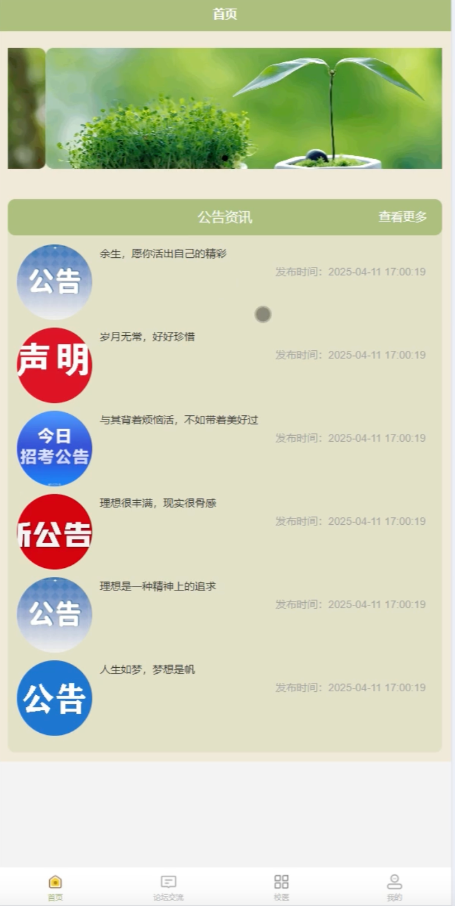
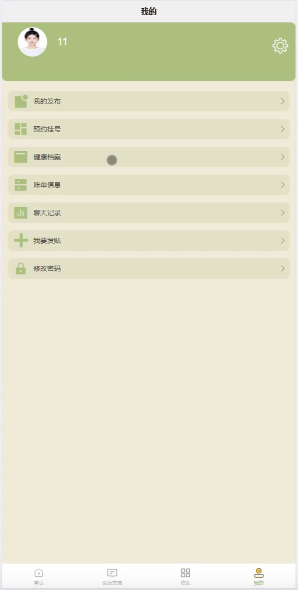
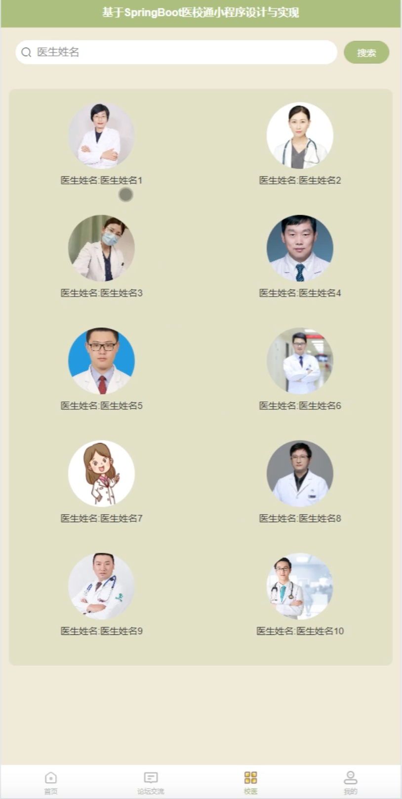
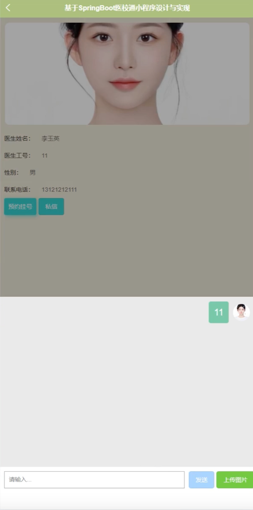
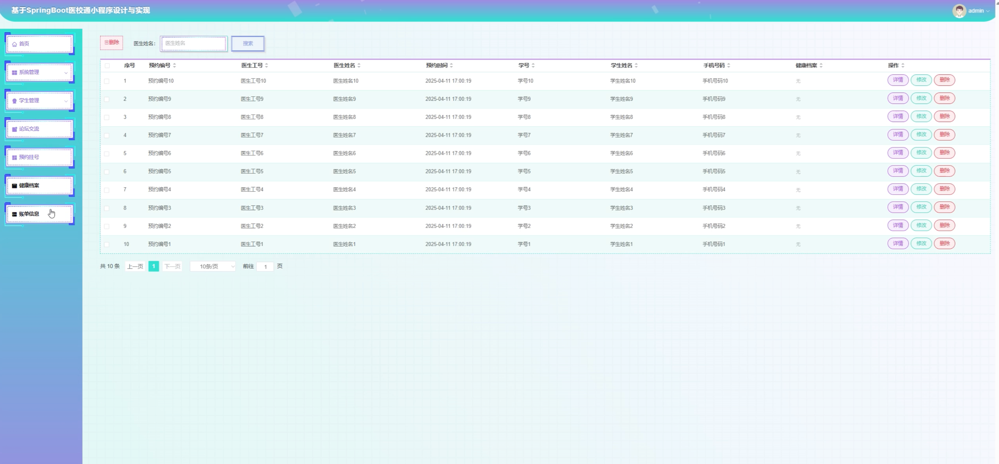

# mpweixinA229D
mpweixinA229D医校通微信小程序+LW
 
## 源码问题查看主页咨询

### 一、关键词
校园医疗系统、医校通系统、学校医务室系统、校医管理系统、学生健康管理系统

### 二、作品包含
源码+数据库+万字设计文档+全套环境和工具资源+本地部署教程

### 三、项目技术
前端技术：Html、Css、Js、Vue3.2、Element-Plus、uniapp
后端技术：Java、SpringBoot3.3.0、MyBatis-Plus

### 四、运行环境（以下版本亲测，其他版本兼容性请自行测试）
开发工具：IDEA/eclipse + VSCODE + HBuilder X + 微信开发者工具

数据库：MySQL 8.0+

数据库管理工具：Navicat10以上版本

环境配置软件：JDK17 + Maven3.6+

前端Nodejs：16+

浏览器：谷歌浏览器

### 五、项目介绍
项目编号：mpweixinA229D

基于SpringBoot的医校通微信小程序，提供便捷的校园医疗服务，方便学生和校医进行医疗管理和健康服务。

角色：管理员、学生

学生功能：注册登录、预约挂号、查看病历、健康档案管理、医药查询、个人中心等。

管理员功能：登录、学生管理、挂号管理、病历管理、药品管理、健康档案管理、系统管理等。

数据库表14张。

### 六、运行截图

